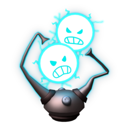

<!--
__     __     _                     
\ \   / /___ | |  ___   _ __  __ _ 
 \ \ / // _ \| | / _ \ | '__|/ _` |
  \ V /|  __/| || (_) || |  | (_| |
   \_/  \___||_| \___/ |_|   \__,_|

Thanks for downloading Velora!

To get started, download the Setup exe from the latest release and run it.
Velora keeps itself up to date automatically after that.

If you run into problems, open an issue on our GitHub page!

Feel free to give us a Star on GitHub!

IMPORTANT:
Make sure you are only downloading from an official source!
The only official sources are:
 - our website (https://www.towerherosmacro.site)
 - our GitHub page (https://github.com/Xan3vo/Velora-Tower-Heroes-Macro)

>>> IGNORE BELOW THIS LINE <<<
-->

<!-- official source warning -->
> [!CAUTION]
> The only official places to download Velora are [towerherosmacro.site][website-link] and this repository's [Releases page][latest-release-link]. Downloads from anywhere else may be tampered with.

<!-- logo banner -->

 

# ⚔️ Velora

<!-- shields -->
[![][website-shield]][website-link]
[![][latest-release-shield]][latest-release-link]
[![][downloads-shield]][downloads-link]
[![][license-shield]][license-link]
 
An open-source *Tower Heroes* macro — Electron UI on an AutoHotkey engine, with OCR game-reading, live stats, and Discord reporting! 
It places **Kart Kid + Slime King**, maxes them, wins the round, collects, and loops — unattended, for hours.
  
🌐 **[towerherosmacro.site][website-link]** — downloads, guides, and a live count of maps Velora has finished.

<a name="installation"><h2>🛠️ Installation</h2></a>

1. Download `Tower-Heroes-Macro-Setup-#.#.#.exe` from [towerherosmacro.site][website-link] or the [latest release][latest-release-link]
2. Run it — if Windows SmartScreen warns (unsigned installer), click **More info → Run anyway**
3. Install [AutoHotkey v1.1][ahk-link] *(not v2)* if you don't have it
4. Launch Velora, pick a map, pick **Easy**, and press **Play** (or `F1`)

> [!IMPORTANT]
> Velora needs Windows display scale at **100%** and a **2560×1440**, **1920×1080**, or **3840×2160** display. The app checks this on launch and tells you exactly what's off.

Once installed, Velora **updates itself** — when a new version ships, an in-app banner offers it with a one-click download & install. You never have to come back here.

<a name="features"><h2>✨ Features</h2></a>

- 🗺️ **5 maps** on Easy — Castle Town, Radiant Reef, Oddport Academy, Corporate Chaos, Glowing Glacier
- 🔎 **OCR game-reading** — map tiles, upgrade buttons ("Upgrade All **MAX**"), and end-of-round coins/XP are read with Windows' built-in offline OCR. No installs, no cloud, no client modification
- 📊 **Live status overlay** — mana / rounds / coins / XP floating on screen while it runs
- 🔔 **Discord webhooks** — round-complete embeds, start/stop summaries, restart alerts with optional @you pings; every event toggleable
- 🧠 **Self-healing** — stuck-state detection, automatic restarts, and a restart-loop guard that stops (and pings you) instead of thrashing all night
- 🎛️ **OCR calibrator** — Settings → Advanced lets you nudge and live-test every OCR region on your own screen

<a name="hotkeys"><h2>⌨️ Hotkeys</h2></a>

| Key | Action |
|:---:|---|
| `F1` | Start the macro |
| `F3` | Stop the macro |
| `F4` | Bring the app windows to front |

Hotkeys are global — they work while Roblox has focus.

<a name="contributing"><h2>🌎 Community & Contributing</h2></a>

Velora is an open-source project and contributions are very welcome!

- **Bugs**: If you hit an issue or an error while using the macro, please open a [bug report][bug-report-link]. Attaching `ocr-debug.log` from `%APPDATA%\tower-heroes-macro\` helps a lot!
- **Suggestions**: Got an idea — a new map, hero loadout, or feature? Submit a [suggestion][suggestion-link]!
- **Code**: PRs are welcome. The engine is plain AutoHotkey v1.1 + an Electron shell — clone, `npm install`, `npm start` and you're developing.

<a name="stars"><h2>🌠 Stars</h2></a>

If Velora saved you some grinding, let us know by giving it a ⭐ $\color{yellow}{\textsf{Star}}$ on GitHub! 
You can do this by clicking the Star button at the top of the page!

<a href="https://github.com/Xan3vo/Velora-Tower-Heroes-Macro/stargazers">
  <picture>
    <source media="(prefers-color-scheme: light)" srcset="http://reporoster.com/stars/Xan3vo/Velora-Tower-Heroes-Macro"> <!-- light theme -->
     <!-- dark theme -->
  </picture>
</a>

<a name="license">

<h4>📝 License</h4>
</a>
Copyright © <a href="https://github.com/Xan3vo">Xan3vo</a> 
This project is licensed under <a href="./LICENSE">MIT</a>.  
Velora simulates normal mouse/keyboard input and never modifies, injects into, or reads the Roblox client.

<!-- links -->
[website-shield]: https://img.shields.io/badge/website-towerherosmacro.site-3670f2?logo=googlechrome&logoColor=white&labelColor=black
[website-link]: https://www.towerherosmacro.site
[latest-release-shield]: https://img.shields.io/github/v/release/Xan3vo/Velora-Tower-Heroes-Macro?logo=github&logoColor=white&labelColor=black&color=3670f2
[latest-release-link]: https://github.com/Xan3vo/Velora-Tower-Heroes-Macro/releases/latest
[downloads-shield]: https://img.shields.io/github/downloads/Xan3vo/Velora-Tower-Heroes-Macro/total?label=downloads&labelColor=black&color=40ca53
[downloads-link]: https://github.com/Xan3vo/Velora-Tower-Heroes-Macro/releases
[license-shield]: https://img.shields.io/badge/license-MIT-blue?labelColor=black
[license-link]: ./LICENSE
[ahk-link]: https://www.autohotkey.com/
[bug-report-link]: https://github.com/Xan3vo/Velora-Tower-Heroes-Macro/issues/new?labels=bug&title=%5BBug%5D%3A+
[suggestion-link]: https://github.com/Xan3vo/Velora-Tower-Heroes-Macro/issues/new?labels=suggestion&title=%5BSuggestion%5D%3A+
